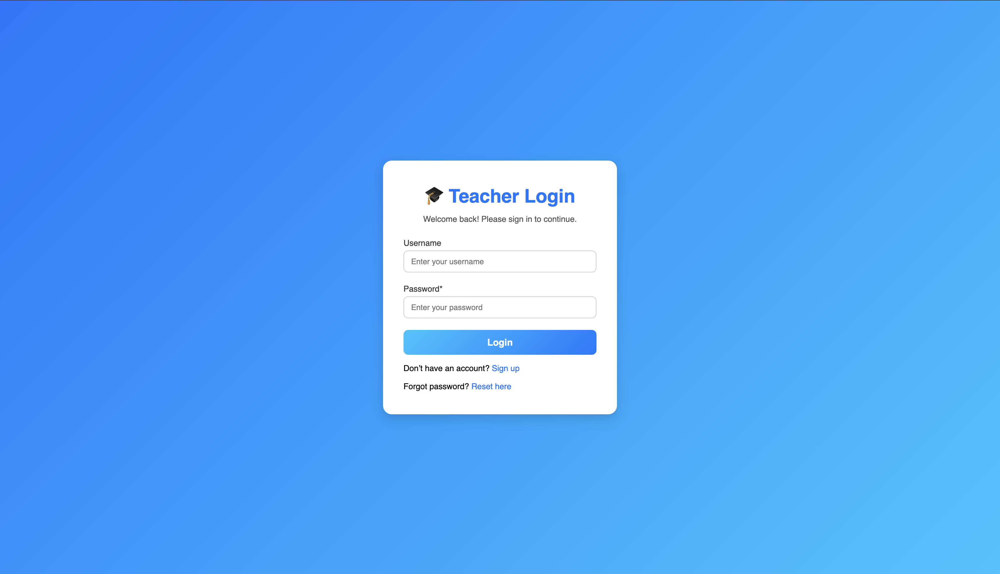
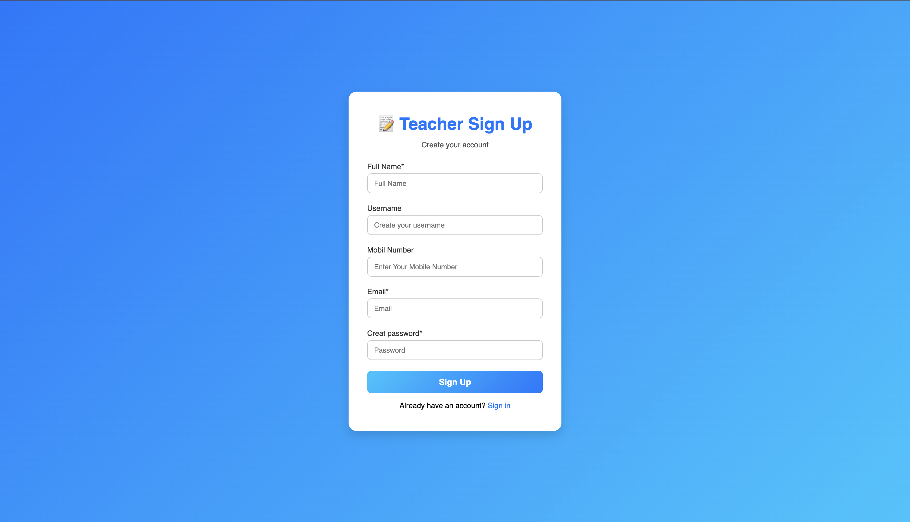
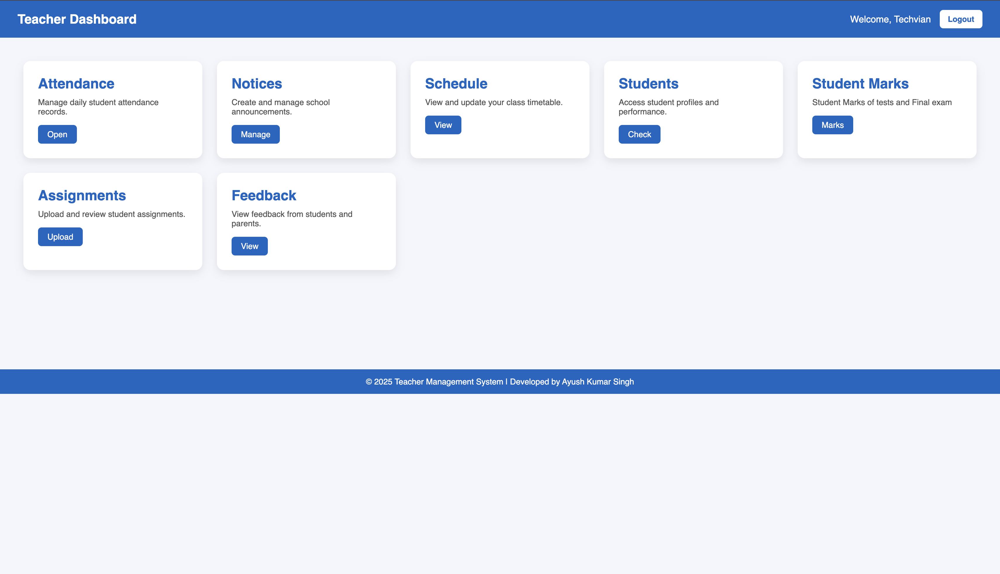
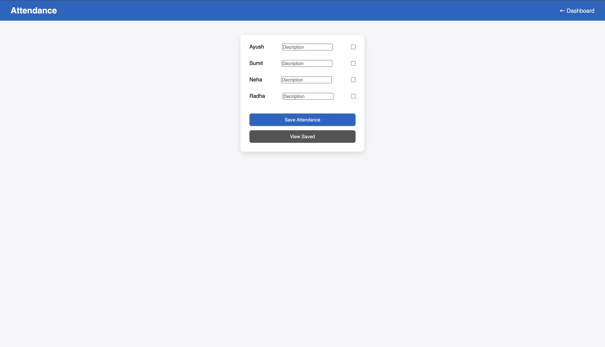

# Teacher Dashboard

A simple **Teacher Dashboard** project created using **HTML and CSS only**.  
This project is made for learning and practice purposes.

## Features
- Teacher dashboard interface
- Login page design
- Clean and simple UI
- Beginner-friendly project

## Technologies Used
- HTML
- CSS  
*(No JavaScript used)*

## Project Structure

```text
Teacher-Dashboard/
│
│── index.html                 # Dashboard
│── style.css                  # Dashboard CSS
│
│── login.html
│── login.css
│
│── README.md
│
├── attendance/
│   │── attendance.html
│   │── attendance.css
│   │── attendance.js
│
├── notices/
│   │── notices.html
│   │── notices.css
│   │── notices.js
│
├── schedule/
│   │── schedule.html
│   │── schedule.css
│   │── schedule.js
│
├── students/
│   │── students.html
│   │── students.css
│   │── students.js
│
├── assignments/
│   │── assignments.html
│   │── assignments.css
│   │── assignments.js
│
├── feedback/
│   │── feedback.html
│   │── feedback.css
|── │── feedback.js
```

---

## Website Screenshots

1. Sign-in page


2. Sign-up page


3. Main-page Teacher-Dashboard


4. Attendance-page


---

## How to Run the Project
1. Download or clone the repository
2. Open the project folder
3. Open `index.html` in any web browser

## Future Improvements
- Add JavaScript for interactivity
- Add backend and database
- Improve responsiveness

## Contributing
Contributions are welcome. Feel free to fork the repository and submit pull requests.

## Author
**Ayush Kumar Singh**  
B.Tech AI & Data Science (1st Year)

---
⭐ If you like this project, give it a star on GitHub!
